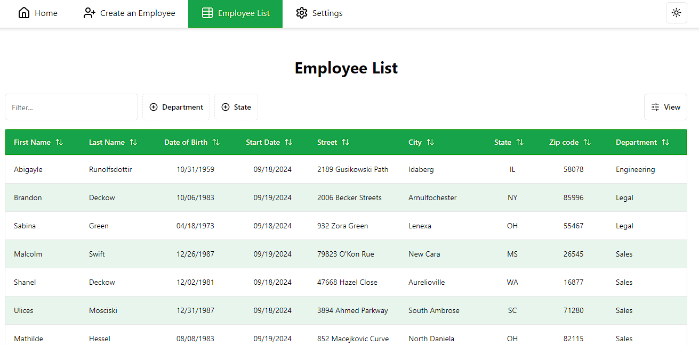

# HRnet


Projet 14 du parcours "**Développeur d'application - JavaScript React**" chez [OpenClassrooms](https://openclassrooms.com/fr/).

## Description

Faites passer une librairie jQuery vers React.



Vous travaillez pour le département technologique d'une grande société financière, WealthHealth.

## Installation

Ce projet a été testé et réalisé avec la version 20.17.0 de Node.js

```bash
npm install

npm run dev
```

[](<[http://](https://github.com/code9g/)>)
[](https://www.linkedin.com/in/pierre-andre-henry/)
